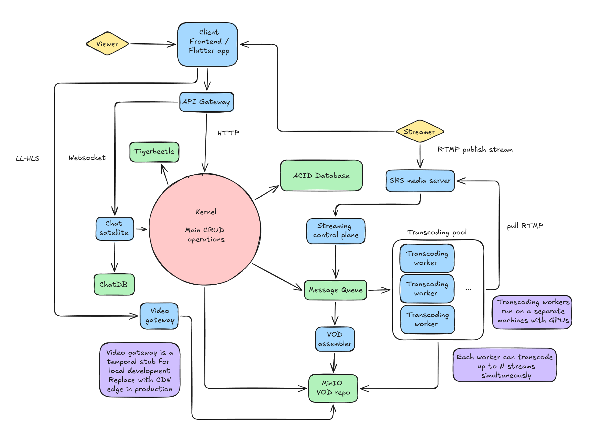

## Overview

Project Horizon is a streaming and VOD platform. A streamer broadcasts via OBS over RTMP, viewers watch through a mobile or web client. Recorded streams are assembled into VODs.

The system follows a hybrid, so called - orbital architecture. We have kernel - modular monolith with main CRUD operations and satellites - microservices around the kernel. They are responsible for video pipeline and realtime chat and stream features.

## Tech Stack

| Component              | Technology                   | Language   |
|------------------------|------------------------------|------------|
| Kernel                 | -                            | Go         |
| Stream control plane   | -                            | Go         |
| Notification satellite | -                            | Go         |
| Transcoder worker      | -                            | C++        |
| Chat satellite         | Phoneix framework            | Elixir     |
| Client (mobile)        | Flutter                      | Dart       |
| Client (web)           | React/Nuxt (TBD)             | TypeScript |
| Ingest server          | SRS (Simple Realtime Server) | -          |
| Message Queue / Events | NATS + JetStream             | -          |
| Primary database       | PostgreSQL                   | -          |
| Chat database          | ScyllaDB                     | -          |
| Financial database     | Tigerbeetle                  | -          |
| VOD storage            | MinIO                        | -          |
| Video gateway          | Nginx                        | -          |

Reference `protocols.md` for info on service interactions, `kernel/` for description of kernel and its modules, `satellites/` for descriptions of each satellite and `infra/` for database / third party tools related stuff.